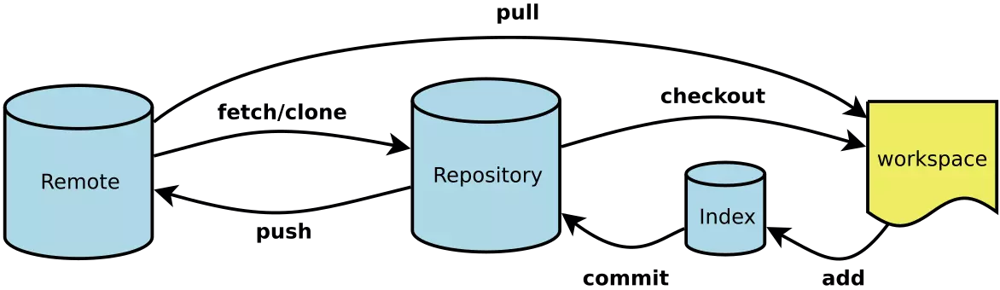

<br>

## 前言

本人平时学习及收集内容，欢迎参入一起讨论。

## 关于作者

一个工作八年的草根程序员。

## 内容

- [分支模型](#一分支模型)
- [Git常用命令清单](#二Git常用命令清单)

### 一、分支模型

用 git flow 初始化工程目录完成后，只能看到两个分支（长期分支）：

- master 分支：用于上线的分支，保护性分支，只包含经过测试的稳定代码，开发人员不能直接工作在此分支上，也不能直接提交改动到 master 分支上。
- develop分支：是开发人员进行任何新的开发的基础分支，当开始一个新的feature 分支的时候，要从 develop 分出去；另外此分支也汇集所有的已完成的功能，等待合并到 master 分支上线。上面两个分支被称为 长期分支  ，存在于项目的整个生命周期中，其他分支，是临时性的，根据需要来创建，当完成了自己的任务后，就会被删掉。
- feature 分支：平常的开发工作使用最频繁的分支。

创建功能分支，如下命令会创建一个名为”feature/” 的功能分支，该分支默认从 develop检出，在做功能性开发的时候，检出一个独立的分支，是版本控制中一个重要 的原则。

```
git flow feature start <branch-name>
```

完成功能分支：

```
git flow feature finish <branch-name>
```

该命令会把我们在当前分支的代码整合到‘develop’分支中去，之后，git-flow 会进行清理操作，删除当下完成的功能分支，将分支切换到‘develop’。

- release 分支：发布分支

创建 release 分支命令如下：

```
git flow release start 1.1.5
```

当你认为现在的‘develop’分支的代码已经是一个成熟的 release 版本的时候，这意味着，首先它包括所有新功能和必要的修复；其二，它已经被彻底的测试过了。如果上述两点都满足，那就是时候创建 release 分支了。
note：release 分支是使用版本号命名的，这个命名方案会让 Git-flow在我们完成 release 后，适当的自动去标记那些 release 提交。

完成 release 分支：

```
git flow release finish 1.1.5
```

上述命令会完成如下一系列操作：

- `git-flow`会拉取远程仓库，确保目前是最新的版本。
- `release` 内容会被合并到 master和develop两个长期分支中去。这样不仅产品代码是最新的，新开的功能分支也将基于最新的代码。

为了便于识别和做历史参考，release 提交会被标记上这个`release`的名字清理操作，版本分支会被删除，并且回到 develop 分支。

>note： 从 Git 的角度看来，release 版本现在已经完成，依据设置，对 master的提交可能已经触发了编译部署流程。或者手动部署。

- hotfix分支：很多时候，当对 release版本做全面测试的时候，可能就会发现一些小错误，在这种情况下，git-flow会提供一个特定的hotfix工作流程。

创建 hotfix 分支:

```
git flow hotfix start bug-fixed
```

上述命令会创建一个名为：`hotfix/bug-fixed` 的分支，这是对产品代码的修复，所以`hotfix`分支是基于`master`分支检出的。
这也是和`release`分支最明显的区别，`release`分支是基于`develop`分支检出的。因为不能再一个还不完全稳定的分支上对产品代码进行修复。
就像`release`一样，修复这个错误，会直接影响到项目的版本号。

完成 hotfix分支：

```
git flow hotfix finish bug-fixed
```

上述命令类似于发布一个`release`版本：

- 完成的改动会被合并到`master`中，同样也会合并到`develop`分支中，这样就可以确保这个错误不会再次出现在下一个`release`中；
- 这个`hotfix`将会被标记起来以便于参考；
- 当前的`hotfix`分支将会被删除，然后切换到`develop`分支；

>note： 完成`hotfix`分支之后，自动或手动启动编译部署流程

下图为整体流程图：


#### 主要分支

- master: 永远处在即将发布(production-ready)状态
- develop: 最新的开发状态

#### 辅助分支

- `feature`: 开发新功能的分支, 基于 develop, 完成后 merge 回 develop
- `release`: 准备要发布版本的分支, 用来修复 bug. 基于 develop, 完成后 merge 回 develop 和 master
- `hotfix`: 修复 master 上的问题, 等不及 release 版本就必须马上上线. 基于 master, 完成后 merge回 master 和 develop

#### 总结

**主要分支**

- master: 永远处在即将发布(production-ready)状态
- develop: 最新的开发状态

**辅助分支**

- feature: 开发新功能的分支, 基于 develop, 完成后 merge 回 develop
- release: 准备要发布版本的分支, 用来修复 bug. 基于 develop, 完成后 merge 回 develop 和 master
- hotfix: 修复 master 上的问题, 等不及 release 版本就必须马上上线. 基于 master, 完成后 merge回 master 和 develop

### 二、Git常用命令清单

git 整体流程图：



- 初始化仓库
- 配置 Git
- 增加删除文件
- 代码提交
- 分支命令
- 标签命令
- 查看信息
- 远程同步
- 撤销

### 初始化仓库

```
# 在当前目录新建一个Git代码库
$ git init

# 新建一个目录，将其初始化为Git代码库
$ git init [project-name]

# 下载一个项目和它的整个代码历史
$ git clone [url]
```

### 配置 Git

Git的设置文件为 .gitconfig，它可以在用户主目录下（全局配置），也可以在项目目录下（项目配置）。

```
# 显示当前的Git配置
$ git config --list

# 编辑Git配置文件
$ git config -e [--global]

# 设置提交代码时的用户信息
$ git config [--global] user.name "[name]"
$ git config [--global] user.email "[email address]"
```

### 增加删除文件

```
# 添加指定文件到暂存区
$ git add [file1] [file2] ...

# 添加指定目录到暂存区，包括子目录
$ git add [dir]

# 添加当前目录的所有文件到暂存区
$ git add .

# 添加每个变化前，都会要求确认
# 对于同一个文件的多处变化，可以实现分次提交
$ git add -p

# 删除工作区文件，并且将这次删除放入暂存区
$ git rm [file1] [file2] ...

# 停止追踪指定文件，但该文件会保留在工作区
$ git rm --cached [file]

# 改名文件，并且将这个改名放入暂存区
$ git mv [file-original] [file-renamed]
```

### 代码提交

```
# 提交暂存区到仓库区
$ git commit -m [message]

# 提交暂存区的指定文件到仓库区
$ git commit [file1] [file2] ... -m [message]

# 提交工作区自上次commit之后的变化，直接到仓库区
$ git commit -a

# 提交时显示所有diff信息
$ git commit -v

# 使用一次新的commit，替代上一次提交
# 如果代码没有任何新变化，则用来改写上一次commit的提交信息
$ git commit --amend -m [message]

# 重做上一次commit，并包括指定文件的新变化
$ git commit --amend [file1] [file2] ...
```

### 分支命令

```
# 列出所有本地分支
$ git branch

# 列出所有远程分支
$ git branch -r

# 列出所有本地分支和远程分支
$ git branch -a

# 新建一个分支，但依然停留在当前分支
$ git branch [branch-name]

# 新建一个分支，并切换到该分支
$ git checkout -b [branch]

# 新建一个分支，指向指定commit
$ git branch [branch] [commit]

# 新建一个分支，与指定的远程分支建立追踪关系
$ git branch --track [branch] [remote-branch]

# 切换到指定分支，并更新工作区
$ git checkout [branch-name]

# 切换到上一个分支
$ git checkout -

# 建立追踪关系，在现有分支与指定的远程分支之间
$ git branch --set-upstream [branch] [remote-branch]

# 合并指定分支到当前分支
$ git merge [branch]

# 选择一个commit，合并进当前分支
$ git cherry-pick [commit]

# 删除分支
$ git branch -d [branch-name]

# 删除远程分支
$ git push origin --delete [branch-name]
$ git branch -dr [remote/branch]
```

### 标签命令

```
# 列出所有tag
$ git tag

# 新建一个tag在当前commit
$ git tag [tag]

# 新建一个tag在指定commit
$ git tag [tag] [commit]

# 删除本地tag
$ git tag -d [tag]

# 删除远程tag
$ git push origin :refs/tags/[tagName]

# 查看tag信息
$ git show [tag]

# 提交指定tag
$ git push [remote] [tag]

# 提交所有tag
$ git push [remote] --tags

# 新建一个分支，指向某个tag
$ git checkout -b [branch] [tag]
```

### 查看信息

```
# 显示有变更的文件
$ git status

# 显示当前分支的版本历史
$ git log

# 显示commit历史，以及每次commit发生变更的文件
$ git log --stat

# 搜索提交历史，根据关键词
$ git log -S [keyword]

# 显示某个commit之后的所有变动，每个commit占据一行
$ git log [tag] HEAD --pretty=format:%s

# 显示某个commit之后的所有变动，其"提交说明"必须符合搜索条件
$ git log [tag] HEAD --grep feature

# 显示某个文件的版本历史，包括文件改名
$ git log --follow [file]
$ git whatchanged [file]

# 显示指定文件相关的每一次diff
$ git log -p [file]

# 显示过去5次提交
$ git log -5 --pretty --oneline

# 显示所有提交过的用户，按提交次数排序
$ git shortlog -sn

# 显示指定文件是什么人在什么时间修改过
$ git blame [file]

# 显示暂存区和工作区的差异
$ git diff

# 显示暂存区和上一个commit的差异
$ git diff --cached [file]

# 显示工作区与当前分支最新commit之间的差异
$ git diff HEAD

# 显示两次提交之间的差异
$ git diff [first-branch]...[second-branch]

# 显示今天你写了多少行代码
$ git diff --shortstat "@{0 day ago}"

# 显示某次提交的元数据和内容变化
$ git show [commit]

# 显示某次提交发生变化的文件
$ git show --name-only [commit]

# 显示某次提交时，某个文件的内容
$ git show [commit]:[filename]

# 显示当前分支的最近几次提交
$ git reflog
```

### 远程同步

```
# 下载远程仓库的所有变动
$ git fetch [remote]

# 显示所有远程仓库
$ git remote -v

# 显示某个远程仓库的信息
$ git remote show [remote]

# 增加一个新的远程仓库，并命名
$ git remote add [shortname] [url]

# 取回远程仓库的变化，并与本地分支合并
$ git pull [remote] [branch]

# 上传本地指定分支到远程仓库
$ git push [remote] [branch]

# 强行推送当前分支到远程仓库，即使有冲突
$ git push [remote] --force

# 推送所有分支到远程仓库
$ git push [remote] --all
```

#### 撤销

```
# 恢复暂存区的指定文件到工作区
$ git checkout [file]

# 恢复某个commit的指定文件到暂存区和工作区
$ git checkout [commit] [file]

# 恢复暂存区的所有文件到工作区
$ git checkout .

# 重置暂存区的指定文件，与上一次commit保持一致，但工作区不变
$ git reset [file]

# 重置暂存区与工作区，与上一次commit保持一致
$ git reset --hard

# 重置当前分支的指针为指定commit，同时重置暂存区，但工作区不变
$ git reset [commit]

# 重置当前分支的HEAD为指定commit，同时重置暂存区和工作区，与指定commit一致
$ git reset --hard [commit]

# 重置当前HEAD为指定commit，但保持暂存区和工作区不变
$ git reset --keep [commit]

# 新建一个commit，用来撤销指定commit
# 后者的所有变化都将被前者抵消，并且应用到当前分支
$ git revert [commit]

# 暂时将未提交的变化移除，稍后再移入
$ git stash
$ git stash pop
```

### 参考资料

- [git 常用命令收集与git-flow 简介](https://juejin.im/post/5ad99c05f265da0b9265231b)
- [Gitflow工作流](https://www.cnblogs.com/jiuyi/p/7690615.html)
- [git-flow 的工作流程](https://www.git-tower.com/learn/git/ebook/cn/command-line/advanced-topics/git-flow)

## 联系作者

<div align="center">
    <p>
        平凡世界，贵在坚持。
    </p>
    
</div>
