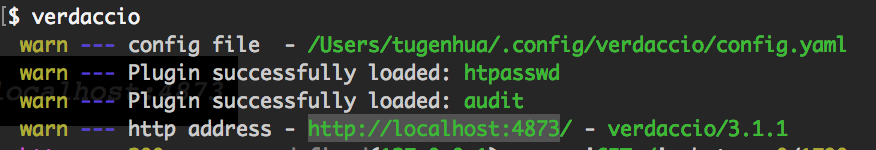
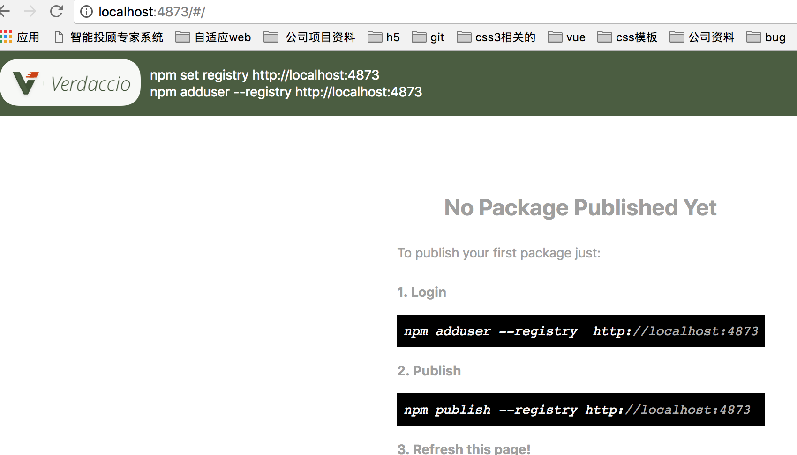
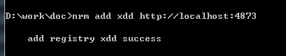
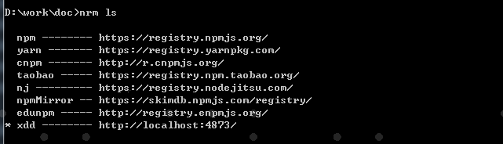
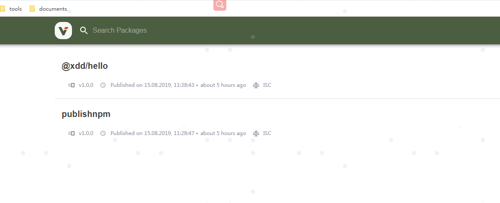
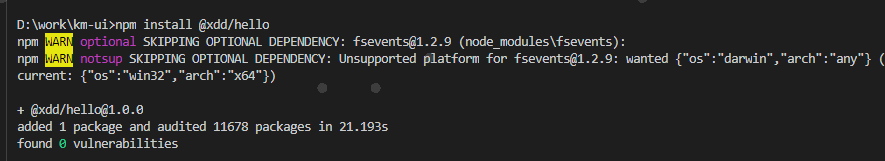

<br>

## 前言

随着公司的业务越来越复杂，项目迭代速度也越来越快，那么项目间的常用的业务代码共享变得非常之有必要。但是对于公司的业务代码是不能对外开放的，因此有必要搭建一个类似于`http://npmjs.org`这个的一个私有平台来管理公司业务相关的组件及代码。

更简单的描述就是我们需要在公司内部搭建一个npm仓库，管理包的同时，也可以借助npm的命令行工具快速用代码模块或业务组件。

但是在没有npm私有仓库之前，我们都是手动复制某个项目的某个模块到相关的项目中，这样操作比较繁琐，因此我们需要一个npm私有仓库存放相关公用的组件及模块。

## 关于作者

一个工作八年的草根程序员。

## 内容

- [npm及私有npm的工作原理？](#一npm及私有npm的工作原理)
- [如何搭建一个私有的npm仓库呢？](#二如何搭建一个私有的npm仓库呢)
- [cnpm搭建](#三cnpm搭建我没试过大家可以尝试一下)
- [通过verdaccio搭建](#四通过verdaccio搭建)

### 一、npm及私有npm的工作原理？

我们使用npm安装，共享和分发代码，npm帮助我们管理项目中的依赖关系，当我们使用npm install去安装一个模块时，会先检查node_modules目录是否已经存在这个模块，如果没有便会向远程仓库查询。

那现在如果我们搭建了私有的npm，当我们使用npm install后会向私有的npm发起请求，服务器会先查询所请求的这个模块是否是我们自己的私有模块或已经缓存过的公共模块，如果是则直接返回给用户，如果不是的话，那么则会继续向上查找(也就是开源的npm仓库)去查找该模块并返回给用户。

### 二、如何搭建一个私有的npm仓库呢？

搭建npm仓库一般有如下基本方法：

1. 使用 Sinopia
2. 使用cnpmjs.org

### 三、cnpm搭建(我没试过，大家可以尝试一下)

[官方网站](https://github.com/cnpm/cnpmjs.org)

- [安装cnpm](#31-安装cnpm)
- [启动并配置服务](#32-启动并配置服务)
- [设置注册地址](#33-设置注册地址)
- [登录cnpm](#34-登录cnpm)
- [包上传到私有仓库](#35-包上传到私有仓库)
- [查看预览包](#36-查看预览包)
- [安装私有包](#37-安装私有包)

#### 3.1 安装cnpm

```
npm install -g --build-from-source cnpmjs.org cnpm sqlite3
# 如果报错或者警告通过下面方式安装
npm install -g --unsafe-perm --verbose --build-from-source cnpmjs.org cnpm sqlite3

```

如果安装不流畅通过下面形式安装：

```
npm install -g --build-from-source \
  --registry=https://registry.npm.taobao.org \
  --disturl=https://npm.taobao.org/mirrors/node \
  cnpmjs.org cnpm sqlite3

```

如果报警告或者安装错误，请添加参数`--unsafe-perm --verbose`

#### 3.2 启动并配置服务

>管理员：myname,othername
>范围：my-company-name,other-name
>默认端口：7001-registry, 7002-web

启动服务

```
$ nohup cnpmjs.org start --admins='myname,othername' \
  --scopes='@my-company-name,@other-name' &
```

#### 3.3 设置注册地址

将cnpm默认注册地址更改为私有注册地址

```
cnpm set registry http://localhost:7001
```

#### 3.4 登录cnpm

```
$ cnpm login
Username: myname
Password: ***
Email: (this IS public) test@test.com
```

#### 3.5 包上传到私有仓库

新建项目

```
$ cd /tmp
$ mkdir helloworld && cd helloworld
$ cnpm init
name: (helloworld) @my-company-name/helloworld
version: (1.0.0)

{
  "name": "@my-company-name/helloworld",
  "version": "1.0.0",
  "description": "my first scoped package",
  "main": "index.js",
  "scripts": {
    "test": "echo \"Error: no test specified\" && exit 1"
  },
  "author": "",
  "license": "ISC"
}

```

上传到私有仓库

```
$ cnpm publish
+ @my-company-name/helloworld@1.0.0
```

#### 3.6 查看预览包

浏览器中预览

```
open http://localhost:7002/@my-company-name/helloworld
```

使用`cnpm`预览

```
cnpm info
```

#### 3.7 安装私有包

所有公共包都可直接使用`cnpm`安装

```
cnpm install hotkeys-js
```

### 四、通过verdaccio搭建

[verdaccio](https://github.com/verdaccio/verdaccio)是一个轻量级的私有npm代理注册。

- [安装](#41-安装)
- [启动服务](#42-启动服务)
- [添加用户/登录](#43-verdaccio的使用)

#### 4.1 安装

```
# 使用 npm 安装
npm install -g verdaccio

```

#### 4.2 启动服务

安装完成后，我们就可以在命令行中 输入`verdaccio`命令运行，如下所示：



然后在浏览器中 运行`http://localhost:4873`就可以看到 如下图所示：



说明服务启动成功了；

当然还可以通过pm2启动，这里不重复说明，有兴趣可以参考相关资料。

#### 4.3 verdaccio的使用

在使用verdaccio之前，我们可以先安装nrm来管理自己的npm代理，nrm可以快速修改，切换，增加npm镜像地址。

先安装nrm，命令如下：

```
npm install -g nrm
```

想要了解更多有关的nrm命令，可以使用 nrm --help, 会列出所有的命令行的。


- [添加别名](#431-添加别名)
- [发布私有包](#432-发布私有包)
- [npm下载包](#433-npm下载包)

##### 4.3.1 添加别名

我这边为了演示下，搭建的地址为`http://localhost:4873`，你们自己可以修改自己的服务器ip地址了；如下命令：

```
nrm add verdaccio http://localhost:4873
```



现在我们可以使用 nrm ls 命令查看 使用的所有镜像源地址，verdaccio 就是我们刚刚新增的，如下图所示：




如果我们现在不想从私有npm上下载包的话，我们可以使用 nrm use xx命令，use下地址。

```
npm adduser --registry  http://localhost:4873
```

##### 4.3.2 发布私有包

首先建立一个私有模块

```
# 假设你建立了一个Git仓库，先克隆下来
git clone git@km-git1.kemai.cn:xiaonengwu/hello.git

# 生成 `package.json` 配置, 注意限定 `@scope` 范围
npm init --scope=xdd
# 提交到仓库
git push origin master

```

如果我们还没有账号的话，通过输入命令 npm adduser, 然后依次输入用户名，密码即可创建完毕。如果已有账号，通过输入命令 npm login，然后依次输入用户名，密码即可登录。命令分别如下：

```
// 添加用户
npm adduser 记得回车

// 登录
npm login 

```

然后发布我们的代码：我们可以使用 npm publish命令来发布包；如下所示：

```
npm publish --registry http://localhost:4873
```

发布完成后，在刷新下 http://localhost:4873/#/ 就可以看到我们刚刚发布的包了，如图



##### 4.3.3 npm下载包

最后我们再验证下，我们新建一个文件夹为 npmtest2，进入到该项目的根目录下，使用命令 npm install @xdd/hello 下载我们刚刚发布到私有的npm包；

如下图所示：



### 参考资料

- [使用verdaccio 搭建npm私有仓库](https://www.cnblogs.com/tugenhua0707/p/9163167.html)
- [在5分钟内搭建企业内部私有npm仓库](https://github.com/jaywcjlove/handbook/blob/master/CentOS/%E5%9C%A85%E5%88%86%E9%92%9F%E5%86%85%E6%90%AD%E5%BB%BA%E4%BC%81%E4%B8%9A%E5%86%85%E9%83%A8%E7%A7%81%E6%9C%89npm%E4%BB%93%E5%BA%93.md)

## 联系作者

<div align="center">
    <p>
        平凡世界，贵在坚持。
    </p>
    
</div>